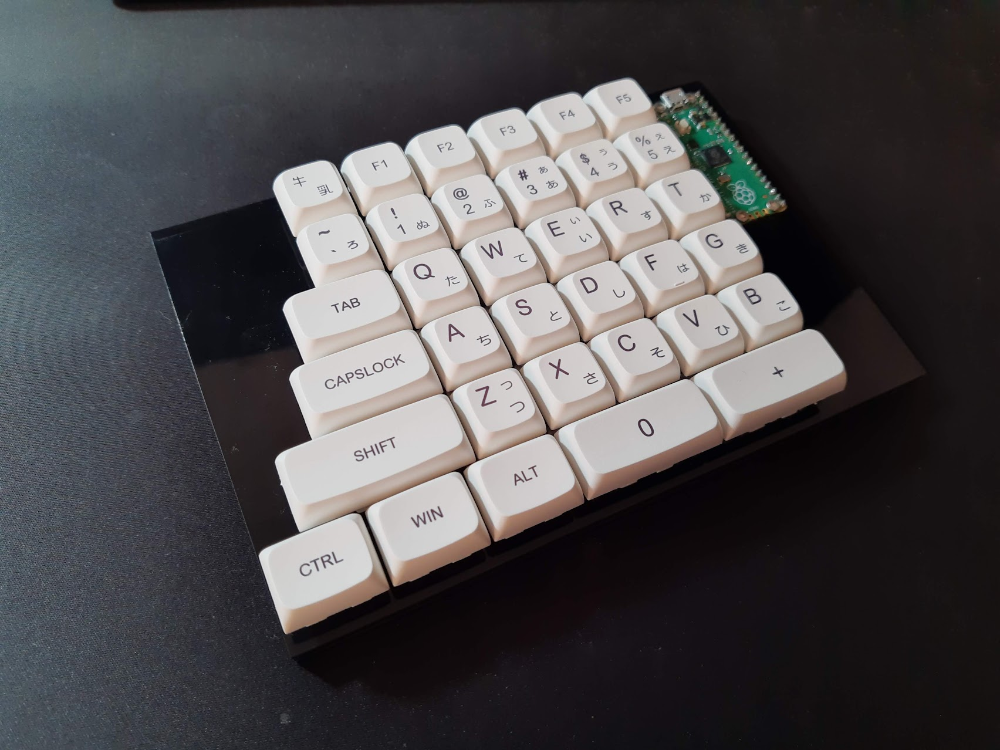
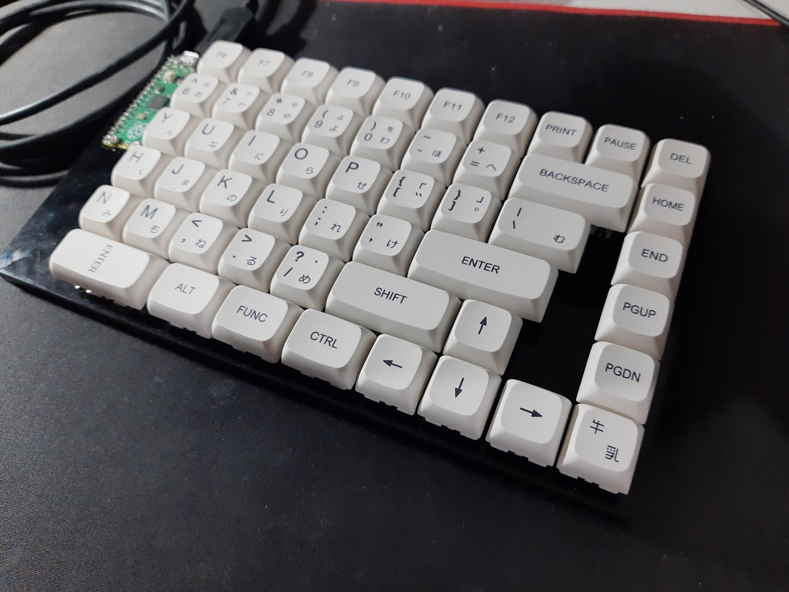
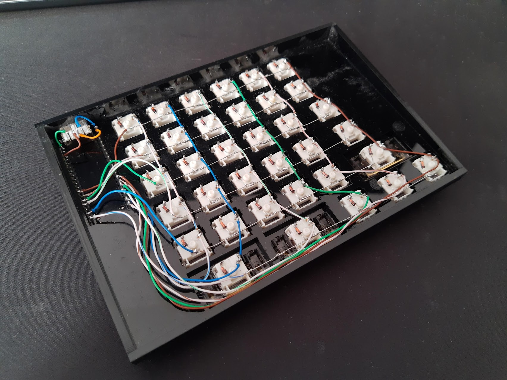
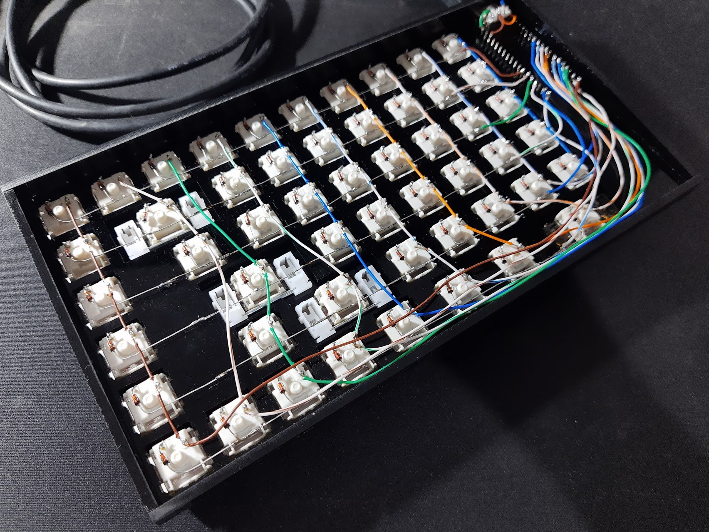

# split-keyboard

This is an 87 key split ortho(ish) keyboard built using 2 Raspberry Pi Pico and the KMK firmware.

Uses CircuitPython version 10.2.1 and the latest version of KMK that are present in this repo under the firmware directory.

The left side is configured to act as an USB drive if the `Esc` key is held whilst the Pico is booting, since it's the main side that should be connected to the computer for regular use the volume gets hidden. The right side automatically boots as an USB drive without the need to press any keys.

  

  

  

